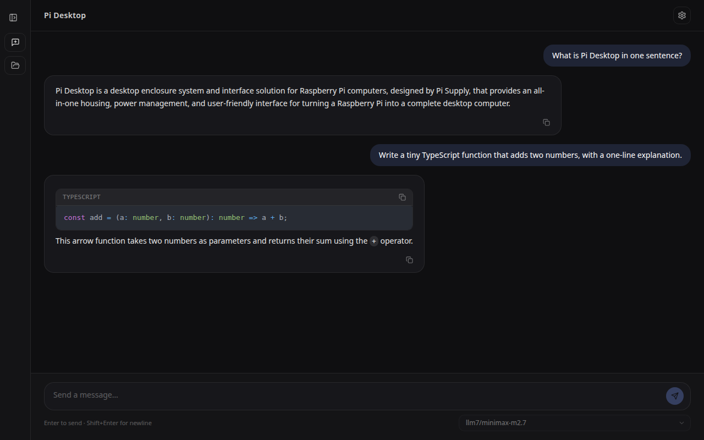

<div align="center">


# Pi Desktop

**A portable AI agent desktop app for everyone — no vendor lock-in, no dev tools required.**

[](https://github.com/tbrandenburg/pi-desktop/actions/workflows/ci.yml)
[](https://github.com/tbrandenburg/pi-desktop/releases/latest)
[](LICENSE)
[](.nvmrc)
[](package.json)
[](CONTRIBUTING.md)

[Getting Started](#getting-started) •
[Features](#features) •
[Configuration](#configuration) •
[Philosophy](#philosophy) •
[Architecture](#architecture) •
[Scripts](#scripts) •
[Contributing](#contributing) •
[Releases](https://github.com/tbrandenburg/pi-desktop/releases)

</div>

---

> [!NOTE]
> 🧪 **Young project, moving fast.** Pi Desktop is under active, early-stage
> development — expect rough edges and breaking changes between releases
> while things settle. We're optimistic about where this is headed (and
> having a lot of geeky fun building it) — feedback and issues are very
> welcome, just don't wire it into anything mission-critical yet.
>
> 💬 **Feedback very welcome.** Drop rough edges, missing pieces, or "this
> almost worked for me" moments in the
> [feedback thread](https://github.com/tbrandenburg/pi-desktop/discussions/80) —
> no need for a formal bug report if it's not quite one yet.

Pi Desktop is a downloadable, double-click desktop app that runs a real
**agent** — not just a chat box — on top of
[`@earendil-works/pi-ai`](https://www.npmjs.com/package/@earendil-works/pi-ai)
and [`@earendil-works/pi-agent-core`](https://www.npmjs.com/package/@earendil-works/pi-agent-core):
a native-feeling Electron + React UI with session history, model picker,
streaming Markdown with syntax-highlighted code, and one-click cancel.

Because it's built on `pi-ai`, there is **no vendor lock-in**: it ships with
[38 built-in provider catalogs](https://www.npmjs.com/package/@earendil-works/pi-ai)
(OpenAI, Anthropic, Google Gemini, OpenRouter, GitHub Copilot, Cerebras,
Fireworks, and more) plus any custom OpenAI-compatible gateway — pick a model,
not a vendor.

It ships with a strict security boundary — the renderer never touches Node
or provider APIs directly, and credentials never leave the main process.

<div align="center">

</div>

## Features

### Present

- **Any model, any provider** 🌐 — 38 built-in `pi-ai` provider catalogs
  plus custom OpenAI-compatible endpoints. Auto-picks up existing
  [Pi CLI](https://github.com/earendil-works/pi) credentials from
  `~/.pi/agent/auth.json`.
- **Real agent, not just chat** 🤖 — `pi-agent-core`'s `AgentHarness`
  tool-calling loop, streamed live. Ships with `read_file`/`list_files`.
- **Resumable sessions** 💾 — Plain JSONL on disk per workspace, not
  app-local storage. Survives restarts with the right model restored.
- **Zero-config first launch** ⚡ — Detects an existing `~/.pi/agent` setup
  and starts chatting with no manual API key entry.
- **Secure by design** 🔒 — Sandboxed renderer, no direct Node/API access;
  credentials never leave the main process.
- **No dev tools required** 📦 — Double-click installer/AppImage for Linux
  and Windows.
- **Local web-bridge dev mode** 🌉 — Opt-in `npm run dev:web`/`make run-web`
  lets a plain browser tab talk to the real backend (real models, chat
  streaming, sessions) without launching Electron — dev-only, never in a
  packaged build.

### Planned

- **Write tools** ✍️ — Let the agent edit/create files, not just read them.
- **Skills, the Pi CLI way** 🧩 — Reuse `pi-agent-core`'s existing
  `SKILL.md` loader so skills you already wrote for Pi CLI work here
  unchanged.
- **Extension system** 🔌 — Same plugin model as Pi CLI, once confirmed
  feasible upstream.
- **Agent definitions** 🧠 — Reusable named agent presets (prompt + tools +
  model), matching Pi CLI.
- **Enterprise-grade hardening** 🏛️ — Audit logging, policy controls, and
  compliance prep for regulated environments.

## Getting started

**Just want to run the app?** Releases don't attach prebuilt binaries yet
(see [Releases](https://github.com/tbrandenburg/pi-desktop/releases)) — for
now, build your own portable installer locally, no code changes needed:

```bash
npm install

# Linux — builds an AppImage under release/
make dist-linux
make run-linux      # launches it directly (or run the .AppImage yourself)
```

> **Running** the resulting `.AppImage` on Linux needs FUSE
> (`libfuse2`/`libfuse2t64`), same as any AppImage — most desktop distros
> ship it already; if not: `sudo apt-get install libfuse2t64` (Ubuntu
> 24.04+) or `libfuse2` (older Ubuntu/Debian). No manual FUSE setup is
> needed to *build* it — `make dist-linux`/`make dist-win` set
> `APPIMAGE_EXTRACT_AND_RUN=1` so electron-builder's own AppImage-packaged
> tooling self-extracts instead of requiring FUSE at build time.

```bash
# Windows — builds an NSIS installer + portable exe under release/
make dist-win
make run-win        # launches the built .exe (via wine when cross-building from Linux)
```

`make run-bundled` picks the right one automatically for your current host
platform once it's been built. See [Scripts](#scripts) for the full command
surface.

**Want to build or hack on it?**

```bash
npm install
npm run dev     # renderer (Vite) + main (tsc -w) + Electron, hot-reloading
```

On first launch, Pi Desktop resolves a working provider and model
automatically from your `~/.pi/agent` config — no manual setup required.

> Prefer `make`? `make install && make run` does the same thing — see
> [Scripts](#scripts) for the full command surface.

**Want to test it in a plain browser tab instead of Electron?**

```bash
npm run dev:web   # or: make run-web
```

Opens the same real backend (real models, real streaming chat, real
sessions) behind a small opt-in local bridge — no Electron window at all,
just open the printed Vite dev server URL in your regular browser. Dev-only:
this bridge never starts in a packaged build.

## Configuration

Pi Desktop currently relies on the standard [Pi agent](https://pi.dev)
configuration — see the [Pi documentation](https://pi.dev/docs/latest) for
the full reference on providers, models, and `~/.pi/agent` credentials. If
you already have a working Pi CLI setup, Pi Desktop picks it up
automatically.

> 🚧 **Under development:** built-in, zero-configuration model access
> (bundled providers you can use out of the box, no API key setup required)
> is planned but not shipped yet — for now, basic Pi agent configuration is
> the supported path.

## Architecture

```text
src/
├── main/          Electron main process (owns Pi, credentials, IPC, storage)
│   ├── llm/       AgentRuntime (pi-agent-core AgentHarness + tool loop),
│   │              models.ts (38 built-in provider catalogs via pi-ai),
│   │              tools/ (read_file, list_files), pi-config.ts (.pi/agent)
│   └── storage/   electron-store wrappers (settings, session metadata)
├── preload/       Narrow, typed IPC bridge exposed to the renderer
├── renderer/      React + Zustand UI (never imports Node or Pi APIs)
└── shared/        Types and Zod schemas shared across processes
```

The renderer speaks only to `window.desktopApi`
(`src/preload/api-types.ts`) — there is no path from the UI to Node, the
filesystem, or provider credentials.

See [`docs/INITIAL.md`](docs/INITIAL.md) for the original design brief.

## Philosophy

Following the same principle as the [Pi project](https://github.com/earendil-works/pi)
it's built on: a small, deliberately-bounded feature set, made robust and
stable, beats a sprawling one that's merely "done."

- **Two tools, on purpose.** The agent ships with exactly `read_file` and
  `list_files` — no shell, write, or edit tools. Read-only by design keeps
  the trust boundary simple to reason about.
- **One runtime path.** Every chat turn goes through the same
  `pi-agent-core` `AgentHarness` loop — no parallel "simple mode"/"agent
  mode" split to maintain.
- **Grow by hardening, not by adding.** New surface area is added only when
  it's proven necessary and can be tested end-to-end against the real
  packaged app (see [`AGENTS.md`](AGENTS.md)) — not spec'd speculatively.

## Scripts

| Command | Description |
| --- | --- |
| `make install` | Install dependencies (`npm install`) |
| `make run` / `make stop` | Start / stop dev mode (Vite + main + Electron) |
| `make run-web` | Start dev mode with the opt-in local web bridge, no Electron window (`make stop` also stops it) |
| `make test` | Run unit tests (`vitest`) |
| `make lint` / `make check` | Type-check renderer + main (`tsc --noEmit`) |
| `make build` | Build renderer + main for production |
| `make pack` | Build + package app dir only, no installer |
| `make dist-linux` | Build + package the Linux AppImage |
| `make dist-win` | Build + package Windows NSIS + portable installers |
| `make clean` | Remove all build artifacts and `node_modules` |

Run `make help` for the full, always-up-to-date list, including
`run-bundled`/`run-linux`/`run-win` and the `version-*`/`release-*`/
`publish` release workflow.

<details>
<summary>Equivalent plain npm scripts</summary>

```bash
npm run check       # tsc --noEmit for both renderer and main
npm test            # vitest unit/integration tests
npm run build        # build renderer + main for production
npm run dist:linux   # package a Linux AppImage (release/)
npm run dev:web      # dev mode via the opt-in local web bridge, no Electron window
```

</details>

## Testing the packaged app

Unit tests and `npm run dev` both run through Vite/Node module resolution
directly and do **not** exercise the real compiled/packaged artifact. Before
trusting a fix, build and launch the real thing:

```bash
make dist-linux
make run-linux   # or: release/linux-unpacked/pi-desktop, or the .AppImage directly
```

See [`AGENTS.md`](AGENTS.md) for detailed guidance on testing the packaged
app and lessons learned while building this project.

## Contributing

Contributions are welcome. See [`CONTRIBUTING.md`](CONTRIBUTING.md) for the
dev setup, pre-PR checks, and code/testing guidelines. Found a bug or have an
idea? [Open an issue](https://github.com/tbrandenburg/pi-desktop/issues/new/choose)
using the bug report or feature request template.

## Acknowledgments

Pi Desktop is a thin UI shell around the [Pi project](https://github.com/earendil-works/pi)
(**[`pi.dev`](https://pi.dev)**) — all model access, provider abstraction,
and agent tool-calling in this app come from its `pi-ai` and `pi-agent-core`
packages. All credit for the underlying agent runtime and multi-provider LLM
API goes to the Pi maintainers; this repo only adds the desktop UI, IPC
boundary, and packaging around it.

## License

[MIT](LICENSE)
</content>
